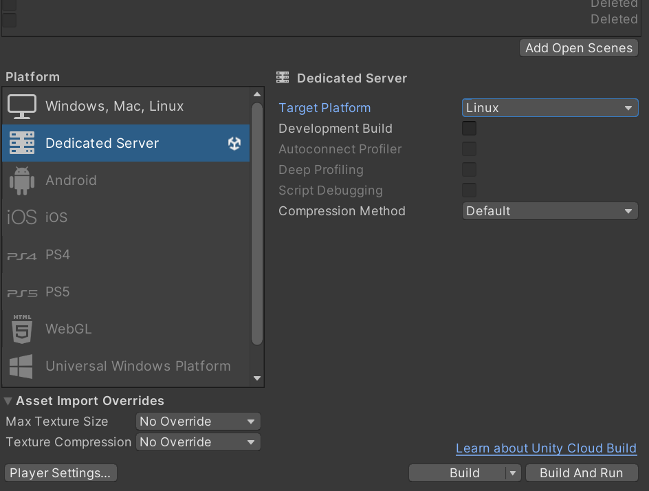
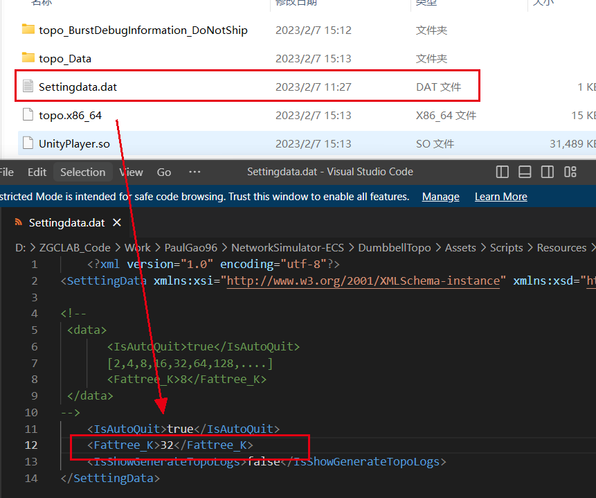
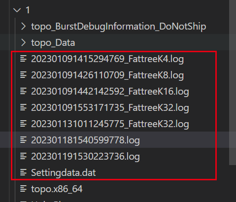
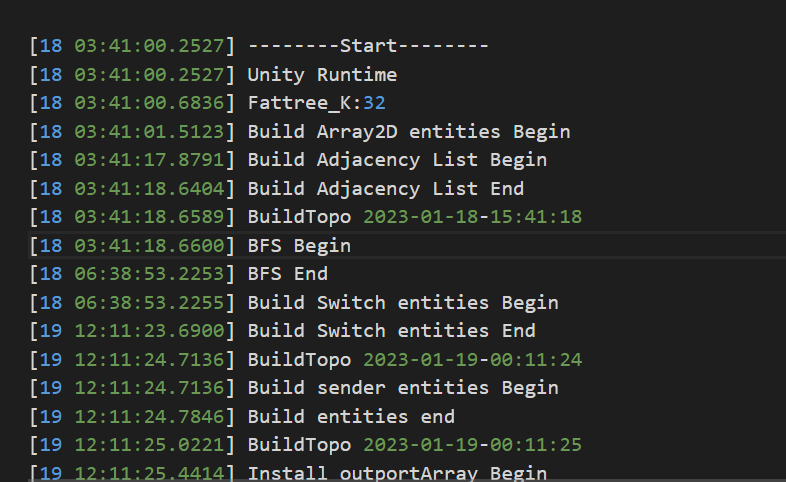

# DONS: Fast and Affordable Discrete Event Network Simulation with Automatic Parallelization

DONS features a data-oriented and multi-threaded simulation engine that can perform automatic parallelization within a server, achieve high core utilization, low cache miss rate, and high memory efficiency, simultaneously. 

For a cluster of servers, DONS also has a novel simulation partitioning algorithm that can assist balanced parallelization. 

# Build prerequisites

Unity Editor Version: 2021.3.11f1

# Compiling

1. Git Clone -> Unity Hub -> Projects -> Open -> Choose folder "DONS"
2. Load scene DONS.unity. Scene position: Assets/Scenes/DONS.unity
3. Build
4. Copy config file to root directory ("Assets/Scripts/Resources/Settingdata.dat")

# Configuration

 In root directory, add the configuration file ”Settingdata.dat“， you can find it in Resources folder 

- The main field is to set the scale of the topology using Fattree_K

```
<!-- 
 <data>
       <IsAutoQuit>true</IsAutoQuit>
	   [2,4,8,16,32,64,128,....]
	   <Fattree_K>8</Fattree_K>
 </data>
-->
	<IsAutoQuit>true</IsAutoQuit>
	<Fattree_K>8</Fattree_K>
</SetttingData>
```

# Running in Ubuntu：

**Step 1 - Build Settings**

Please make sure you have something similar to the following screenshot and click Build.




**Step 2 - Configuration**

Copy "Assets/Scripts/Resources/Settingdata.dat" to output folder.

Edit it to set the scale of the topology.




**Step 3 - Running**

- Copy output folder to Linux.

- Then cd output

- Add the **execute** permission

  ```
  chmod +x topo.x86_64
  ```

- Run topo.x86_64

  ```
  ./topo.x86_64
  ```

  

**Step 4 - Output**

Obtain related information by viewing log files






# Important Links 

1. [Job system](https://github.com/Unity-Technologies/EntityComponentSystemSamples/blob/master/Docs/jobs.md)
2. [Entities and components](https://github.com/Unity-Technologies/EntityComponentSystemSamples/blob/master/Docs/entities-components.md)
3. [Systems](https://github.com/Unity-Technologies/EntityComponentSystemSamples/blob/master/Docs/systems.md)
4. [Accessing entities in jobs](https://github.com/Unity-Technologies/EntityComponentSystemSamples/blob/master/Docs/entities-jobs.md)
5. [Entity command buffers](https://github.com/Unity-Technologies/EntityComponentSystemSamples/blob/master/Docs/entity-command-buffers.md)
6. [Transform components and systems](https://github.com/Unity-Technologies/EntityComponentSystemSamples/blob/master/Docs/transforms.md)
7. [Baking and entity scenes](https://github.com/Unity-Technologies/EntityComponentSystemSamples/blob/master/Docs/baking.md)
8. [Additional Entities features](https://github.com/Unity-Technologies/EntityComponentSystemSamples/blob/master/Docs/additional-entities-features.md)

## 
