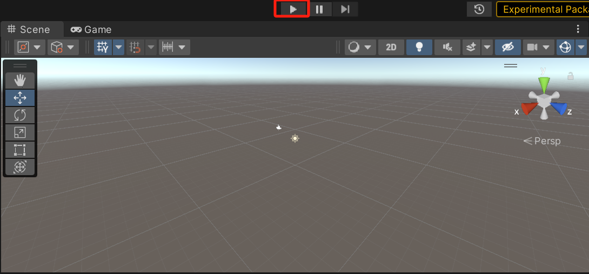

# DONS: Fast and Affordable Discrete Event Network Simulation with Automatic Parallelization

DONS features a data-oriented and multi-threaded simulation engine that can perform automatic parallelization within a server, achieve high core utilization, low cache miss rate, and high memory efficiency, simultaneously. 

For a cluster of servers, DONS also has a novel simulation partitioning algorithm that can assist balanced parallelization. 

SIGCOMM'23 paper: https://dl.acm.org/doi/10.1145/3603269.3604844

# Installation guide

1. Open Unity Editor (version: 2021.3.11f1)
2. Open the Package Manager (menu: **Window** > **Package Manager**).
3. Click the small gear icon on the upper right and select the **Advanced Project Settings** menu item.
4. Check **Enable Preview Packages** in the Project Settings window.
5. In the Package Manager window, click the small `+` icon in the upper left and select **Add package from git URL...**
6. Find the version of the DOTS packages you want to use, i.e. check https://docs.unity3d.com/Packages/com.unity.rendering.hybrid@latest
7. Enter the package followed by the version number, e.g. `com.unity.rendering.hybrid@0.7.0-preview.24` and confirm. 

This will add the **Hybrid Renderer** package and all its dependencies, e.g. **Entities**, **Burst**, **Collections**, **Jobs** and **Mathematics**. Now you can start to use DOTS in you project.

**Note:** You can use the [Unity Hub](https://unity3d.com/get-unity/download) to install multiple versions of Unity on the same computer.


# Compiling

1. Git clone this project
2. Open Unity Hub -> Projects -> Open -> Choose folder "DONS"
3. Load scene DONS.unity (Assets/Scenes/DONS.unity), i.e., drag the icon into the sidebar "Hierarchy"
4. Unity Editor will compile the source code in the project

# Running in Unity Editor

1. Click this icon to run a simple network simulation task

Simulation task: the network topology is FatTree (k = 4), in which 8 hosts send traffic to 8 other hosts, the number of packets per flow is 10k.
2. Results: when the Console output "Host X End" represents the completion of the traffic transmission, as well as the FCT.


Note: there are currently no meaningful UI in the scene, and the DONS frontend will be released in the future.

# Running in Linux server (headless mode)：

**Step 1 - Build Settings**

Click File in Unity Editor, then click Build Settings.

Please make sure you have something similar to the following screenshot and click Build.


**Step 2 - Configuration**

1. We provide the template configuration file in "DONS\Assets\Scripts\Resources\Settingdata.dat".

- The main field is to set the scale of the topology using Fattree_K

```
<!-- 
 <data>
       <IsAutoQuit>true</IsAutoQuit>
	   [2,4,8,16,32,64,128,....]
	   <Fattree_K>8</Fattree_K>
 </data>
-->
	<IsAutoQuit>true</IsAutoQuit>
	<Fattree_K>8</Fattree_K>
</SetttingData>
```

2. Copy "Assets/Scripts/Resources/Settingdata.dat" to output folder.

Edit it to set the scale of the topology.


**Step 3 - Running**

1. Copy these output folders to Linux server.

2. Add the **execute** permission

  ```
  chmod +x topo.x86_64
  ```

3. Run a network simulation task

  ```
  ./topo.x86_64
  ```

  

**Step 4 - Results**

Log file position: topo_Data/XXXX.log

With logs, the distribution of FCT and congestion queue length can be analyzed.


# Important Links 

1. [Job system](https://github.com/Unity-Technologies/EntityComponentSystemSamples/blob/master/EntitiesSamples/Docs/jobs.md)
2. [Entities and components](https://github.com/Unity-Technologies/EntityComponentSystemSamples/blob/master/EntitiesSamples/Docs/entities-components.md)
3. [Systems](https://github.com/Unity-Technologies/EntityComponentSystemSamples/blob/master/EntitiesSamples/Docs/systems.md)
4. [Accessing entities in jobs](https://github.com/Unity-Technologies/EntityComponentSystemSamples/blob/master/EntitiesSamples/Docs/entities-jobs.md)
5. [Entity command buffers](https://github.com/Unity-Technologies/EntityComponentSystemSamples/blob/master/EntitiesSamples/Docs/entity-command-buffers.md)
6. [Transform components and systems](https://github.com/Unity-Technologies/EntityComponentSystemSamples/blob/master/EntitiesSamples/Docs/transforms.md)
7. [Baking and entity scenes](https://github.com/Unity-Technologies/EntityComponentSystemSamples/blob/master/EntitiesSamples/Docs/baking.md)
8. [Additional Entities features](https://github.com/Unity-Technologies/EntityComponentSystemSamples/blob/master/EntitiesSamples/Docs/additional-entities-features.md)

## 
